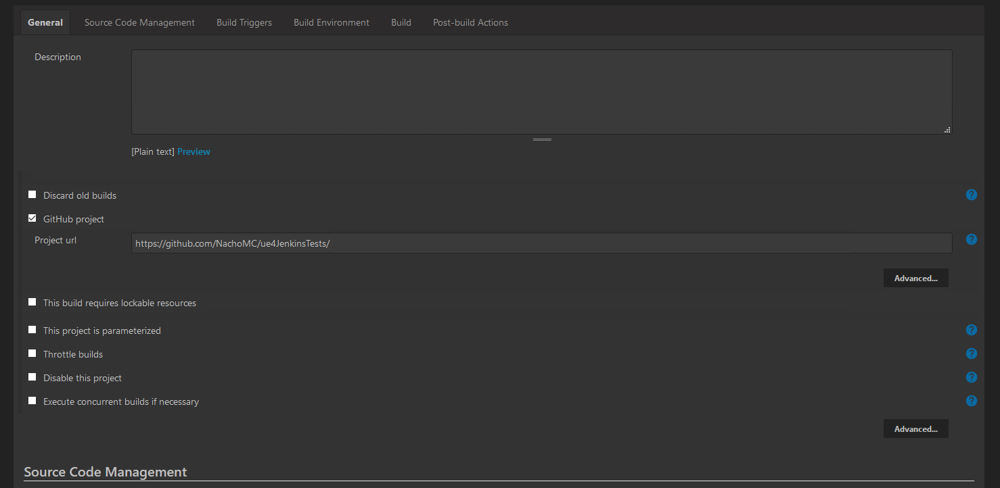
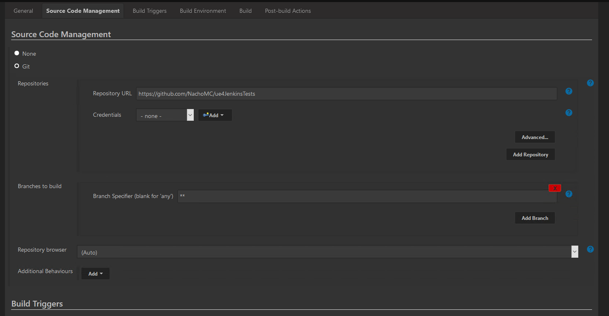
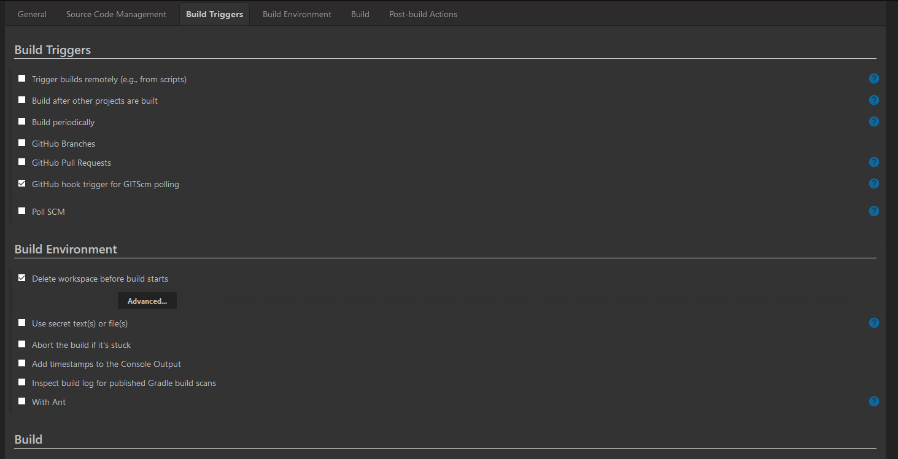
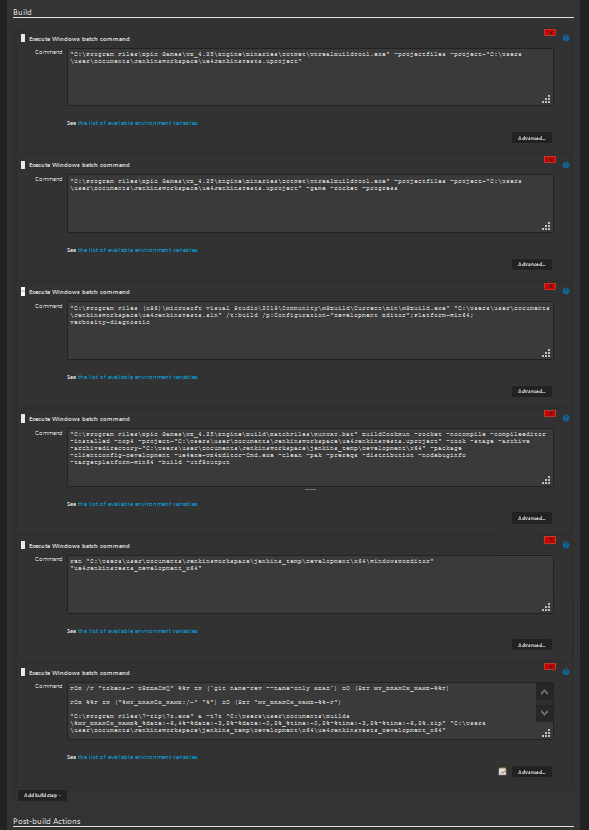
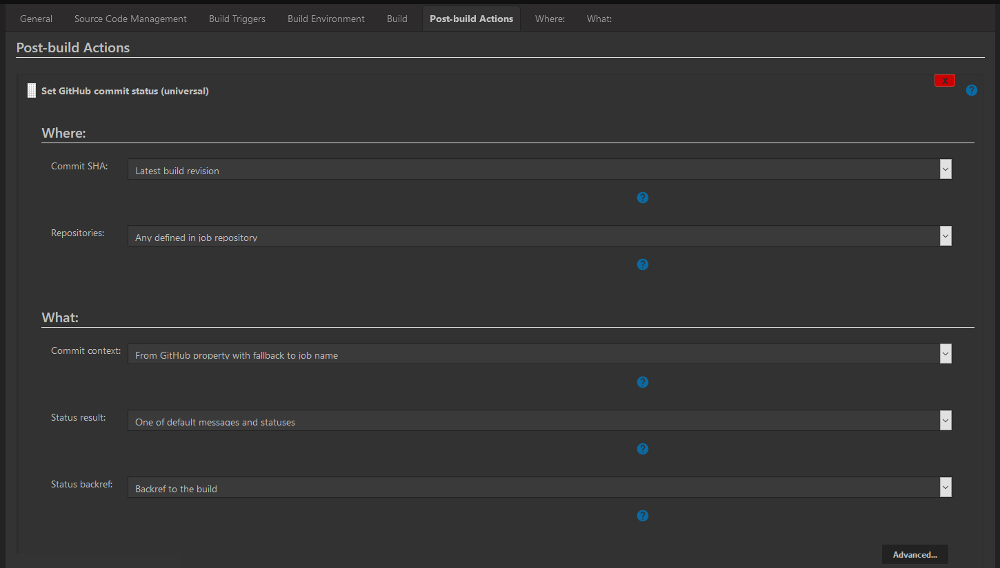
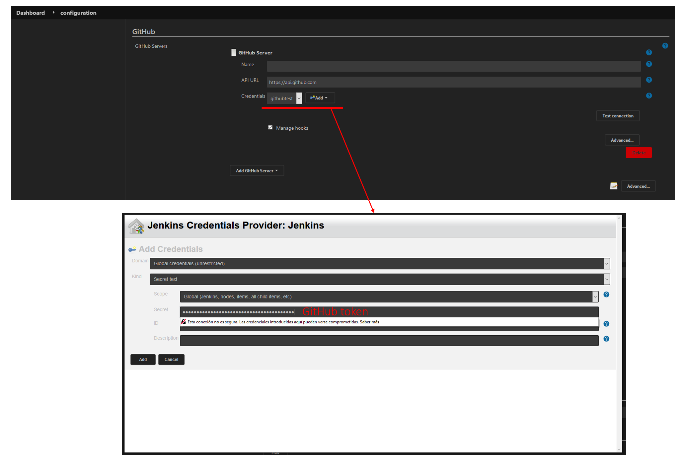

# Jenkins + UE4 + GitHub

## Jenkins Project config

### Build commands

---

"C:\Program Files\Epic Games\UE_4.25\Engine\Binaries\DotNet\UnrealBuildTool.exe" -projectfiles -project="C:\Users\user\Documents\JenkinsWorkspace\ue4JenkinsTests.uproject"

---

"C:\Program Files\Epic Games\UE_4.25\Engine\Binaries\DotNet\UnrealBuildTool.exe" -projectfiles -project="C:\Users\user\Documents\JenkinsWorkspace\ue4JenkinsTests.uproject" -game -rocket -progress

---

"C:\Program Files (x86)\Microsoft Visual Studio\2019\Community\MSBuild\Current\Bin\MSBuild.exe" "C:\Users\user\Documents\JenkinsWorkspace\ue4JenkinsTests.sln" /t:build /p:Configuration="Development Editor";Platform=Win64;verbosity=diagnostic

---

"C:\Program Files\Epic Games\UE_4.25\Engine\Build\BatchFiles\RunUAT.bat" BuildCookRun -rocket -nocompile -compileeditor -installed -nop4 -project="C:\Users\user\Documents\JenkinsWorkspace\ue4JenkinsTests.uproject" -cook -stage -archive -archivedirectory="C:\Users\user\Documents\JenkinsWorkspace\jenkins_temp\Development\x64" -package -clientconfig=Development -ue4exe=UE4Editor-Cmd.exe -clean -pak -prereqs -distribution -nodebuginfo -targetplatform=Win64 -build -utf8output

---

ren "C:\Users\user\Documents\JenkinsWorkspace\jenkins_temp\Development\x64\WindowsNoEditor" "ue4JenkinsTests_Development_x64"

---

FOR /F "tokens=* USEBACKQ" %%F IN (`git name-rev --name-only HEAD`) DO (SET MY_BRANCH_NAME=%%F)

FOR %%F IN ("%MY_BRANCH_NAME:/=" "%") DO (SET "MY_BRANCH_NAME=%%~F")

"C:\Program Files\7-Zip\7z.exe" a -t7z "C:\Users\user\Documents\Builds\%MY_BRANCH_NAME%_%date:~6,4%-%date:~3,2%-%date:~0,2%_%time:~0,2%-%time:~3,2%-%time:~6,2%.zip" "C:\Users\user\Documents\JenkinsWorkspace\jenkins_temp\Development\x64\ue4JenkinsTests_Development_x64"

---

## Jenkins System config

  

## Bibliography

[Automation with Unreal Engine and Jenkins-CI](https://patricevignola.com/post/automation-jenkins-unreal)

[GitHub Setup](https://applitools.com/blog/how-to-update-jenkins-build-status-in-github-pull-requests-step-by-step-tutorial)
